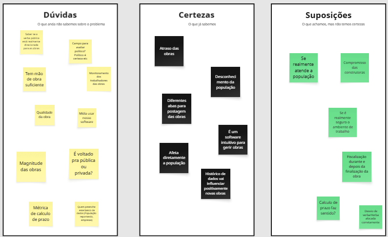
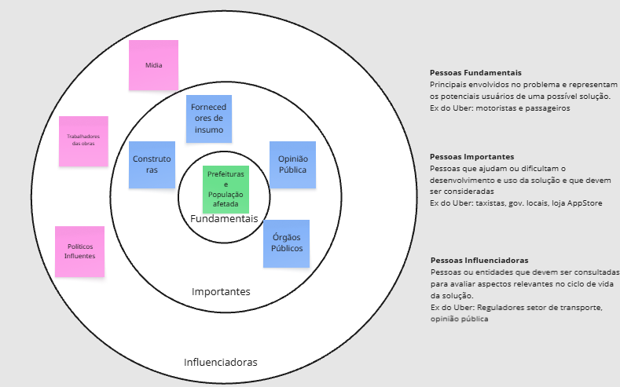
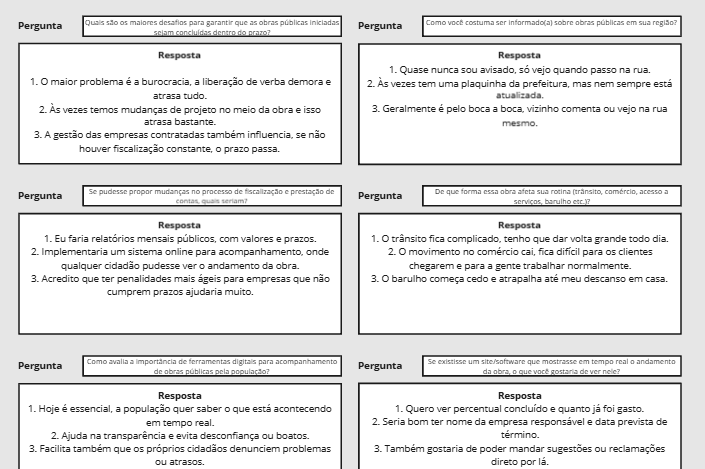
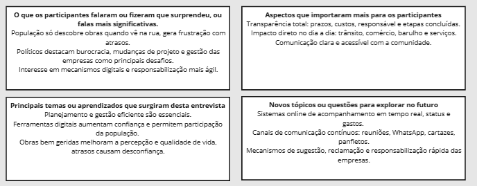

# Introdução

Informações básicas do projeto.

- **Projeto:** [OBRA-PRIMA]
- **Repositório GitHub:** [\[LINK PARA O REPOSITÓRIO NO GITHUB\]](https://github.com/ICEI-PUC-Minas-PMGES-TI/pmg-es-2025-2-ti1-2401100-obraspublicas.git)
- **Membros da equipe:**

  - [Gustavo Henrique de Lima](https://github.com/Gustavo21hl)
  - [João Victor Vial Leite Soares](https://github.com/jvvls)
  - [Esdras Manassés Borges de Oliveira](https://github.com/)
  - [Guilherme Augusto Martins de Carvalho](https://github.com/)
  - [Lucas Damacena de Souza](https://github.com/)

A documentação do projeto é estruturada da seguinte forma:

1. Introdução
2. Contexto
3. Product Discovery
4. Product Design
5. Metodologia
6. Solução
7. Referências Bibliográficas

✅ [Documentação de Design Thinking (MIRO)](https://miro.com/app/board/uXjVJSv4Y9k=/)

# Contexto

A gestão de obras públicas é um tema central no desenvolvimento de cidades e comunidades, já que envolve diretamente a infraestrutura, o bem-estar social e a qualidade de vida da população. No entanto, em Belo Horizonte, esse processo muitas vezes é marcado pela falta de transparência, pela dificuldade de acesso às informações e pela ausência de participação da sociedade. Obras iniciadas sem divulgação clara, atrasos sem justificativas públicas e abandono de construções são situações recorrentes que acabam gerando descrença e frustração nos cidadãos.
Nesse cenário, percebemos a necessidade de aproximar a população da gestão das obras públicas, criando um espaço acessível onde informações sejam divulgadas de forma organizada e a sociedade tenha voz para acompanhar e avaliar o andamento dessas iniciativas.

## Problema

Atualmente, a má gestão de obras públicas e a pouca ou nenhuma transparência com a população resultam em grandes prejuízos sociais e econômicos. A falta de clareza quanto a prazos, custos e responsáveis alimenta a desconfiança da sociedade em relação aos gestores públicos e empresas contratadas. Além disso, os cidadãos raramente têm a oportunidade de participar ativamente do acompanhamento das obras ou de manifestar suas opiniões de forma estruturada. Isso gera distanciamento entre governo e população, além de dificultar o controle social e a responsabilização em casos de irregularidades.

## Objetivos

A finalidade do projeto é desenvolver uma aplicação web que funcione de maneira similar a uma rede social, dedicada exclusivamente ao acompanhamento de obras públicas. Permitir que empresas e órgãos responsáveis cadastrem e publiquem informações detalhadas sobre as obras. Oferecer à população a possibilidade de acompanhar prazos, custos e etapas do andamento das construções. Criar um espaço interativo em que cidadãos possam comentar, avaliar e expressar suas opiniões sobre as obras em execução. Promover maior transparência e engajamento social, fortalecendo a relação entre gestores e comunidade. Auxiliar na fiscalização coletiva e na cobrança por melhores práticas na gestão de recursos públicos.

## Justificativa

A escolha desse tema surgiu da percepção de que a transparência e a eficiência na gestão de obras públicas são fundamentais para a melhoria da qualidade de vida urbana. A população, que é a principal beneficiária dessas construções, frequentemente não tem acesso a informações essenciais e acaba sendo surpreendida com atrasos, obras inacabadas ou má qualidade na execução.
Dessa forma, o projeto busca oferecer uma solução simples, acessível e participativa, que não apenas disponibilize dados de maneira organizada, mas também dê voz à sociedade. Acreditamos que uma plataforma nesse formato fortalece a cidadania, estimula o controle social e contribui para a construção de um ambiente mais democrático e colaborativo.

## Público-Alvo

O projeto é voltado principalmente para dois públicos:

Cidadãos em geral, que serão os principais usuários interessados em acompanhar as obras de sua cidade, manifestar suas opiniões e participar ativamente do processo de fiscalização e cobrança. Esse público é abrangente, incluindo pessoas de diferentes idades, classes sociais e regiões, já que todos são impactados pelas obras públicas.

Empresas e órgãos públicos responsáveis pelas obras, que terão um canal moderno e confiável para divulgar informações de forma transparente, aproximando-se da população e fortalecendo sua credibilidade.

# Product Discovery

## Etapa de entendimento

- **Matriz CSD:**



- **Mapa de stakeholders:**



- **Entrevista qualitativa:**



- **Highlights de pesquisa:**




## Etapa de Definição

### Personas

| Persona 1                            | Persona 2                            |
| ------------------------------------ | ------------------------------------ |
|  |  |

| Persona 3                            | Persona 4                            |
| ------------------------------------ | ------------------------------------ |
|  |  |

| Persona 5                            | Persona 6                            |
| ------------------------------------ | ------------------------------------ |
|  |  |

# Product Design

Nesse momento, vamos transformar os insights e validações obtidos em soluções tangíveis e utilizáveis. Essa fase envolve a definição de uma proposta de valor, detalhando a prioridade de cada ideia e a consequente criação de wireframes, mockups e protótipos de alta fidelidade, que detalham a interface e a experiência do usuário.

## Histórias de Usuários

Com base na análise das personas foram identificadas as seguintes histórias de usuários:

| EU COMO...`PERSONA`              | QUERO/PRECISO ...`FUNCIONALIDADE`                                               | PARA ...`MOTIVO/VALOR`                                                                                 |
| -------------------------------- | ------------------------------------------------------------------------------- | ------------------------------------------------------------------------------------------------------ |
| Usuário do sistema               | Lista de todas as obras em andamento, com informações básicas                   | Acompanhar de forma prática o que está sendo feito e cobrar melhorias quando necessário.               |
| Estudante                        | Acessar informações detalhadas de uma obra                                      | Usar os dados como referência em trabalhos acadêmicos e compreender como os projetos são estruturados. |
| Gestor de obras                  | Cadastrar uma nova obra no sistema incluindo informações completas              | Garantir que os dados oficiais estejam acessíveis à população.                                         |
| Morador de bairro afetado        | Preciso filtrar por localização, tipo de serviço e status                       | Acompanhar apenas as que impactam diretamente minha região.                                            |
| Jornalista                       | Baixar imagens oficiais e documentos em PDF                                     | Divulgar informações verificadas e confiáveis em reportagens.                                          |
| ONG que monitora gastos públicos | Consultar um histórico de obras concluídas, com valores orçados e gastos finais | Avaliar se houve compatibilidade entre planejamento e execução.                                        |
| Liderança comunitária            | Registrar comentários e observações sobre o andamento das obras do meu bairro   | Levar ao conhecimento dos gestores os problemas enfrentados pela população local.                      |

## Proposta de Valor


## Requisitos

As tabelas que se seguem apresentam os requisitos funcionais e não funcionais que detalham o escopo do projeto.

### Requisitos Funcionais

| ID     | Descrição do Requisito                                                                                                     | Prioridade |
| ------ | -------------------------------------------------------------------------------------------------------------------------- | ---------- |
| RF-001 | O sistema deve permitir que o usuário visualize a lista de todas as obras cadastradas.                                     | ALTA       |
| RF-002 | O sistema deve mostrar todos os detalhes de uma obra                                                                       | ALTA       |
| RF-003 | O sistema deve permitir filtrar e pesquisar obras por bairro, status ou tipo de obra.                                      | ALTA       |
| RF-004 | O sistema deve permitir ao usuário visualizar uma linha do tempo com as etapas já realizadas e as próximas etapas da obra. | ALTA       |
| RF-005 | O sistema deve permitir que usuários autenticados (população com cadastro) publiquem comentários em uma obra.              | MÉDIA      |
| RF-006 | O sistema deve permitir que outros usuários visualizem os comentários postados sobre determinada obra.                     | MÉDIA      |
| RF-007 | O sistema deve permitir a exibição de fotos atualizadas das obras.                                                         | ALTA       |
| RF-008 | O sistema deve permitir o upload de fotos das obras por usuários autorizados (gestores públicos).                          | BAIXA      |
| RF-009 | O sistema deve permitir que os gestores atualizem o status e os detalhes de uma obra.                                      | ALTA       |
| RF-110 | O sistema deve permitir ao usuário cadastrar-se utilizando e-mail e senha.                                                 | BAIXA      |

### Requisitos não Funcionais

| ID      | Descrição do Requisito                                                                                              | Prioridade |
| ------- | ------------------------------------------------------------------------------------------------------------------- | ---------- |
| RNF-001 | O sistema deve estar disponível 24 horas por dia, 7 dias por semana.                                                | ALTA       |
| RNF-002 | O site deve ser responsivo, permitindo acesso adequado tanto em computadores quanto em dispositivos móveis.         | ALTA       |

## Projeto de Interface

Artefatos relacionados com a interface e a interacão do usuário na proposta de solução.

### Wireframes

Estes são os protótipos de telas do sistema.

#### Home-page


#### Tela de Login


#### Tela Cadastro de cidadão


#### Tela Cadastro de Construtora


#### Tela Principal Cidadão


#### Tela Principal Contrutora


#### Tela Principal com obra selecionada


#### Tela de cidadão comentando


#### Tela de Publicação de obra


#### Tela de atualização de obra


### User Flow


### Protótipo Interativo

**✳️✳️✳️ COLOQUE AQUI UM IFRAME COM SEU PROTÓTIPO INTERATIVO ✳️✳️✳️**

✅ [Protótipo Interativo (MarvelApp)](https://marvelapp.com/prototype/4hd6091?emb=1&iosapp=false&frameless=false) ⚠️ EXEMPLO ⚠️

> ⚠️ **APAGUE ESSA PARTE ANTES DE ENTREGAR SEU TRABALHO**
>
> Um protótipo interativo apresenta o projeto de interfaces e permite ao usuário navegar pelas funcionalidades como se estivesse lidando com o software pronto. Utilize as mesmas ferramentas de construção de wireframes para montagem do seu protótipo interativo. Inclua o link para o protótipo interativo do projeto.

# Metodologia

Detalhes sobre a organização do grupo e o ferramental empregado.

## Ferramentas

Relação de ferramentas empregadas pelo grupo durante o projeto.

| Ambiente                    | Plataforma | Link de acesso                                                                         |
| --------------------------- | ---------- | -------------------------------------------------------------------------------------- |
| Processo de Design Thinking | Miro       | https://miro.com/app/board/uXjVJSv4Y9k=/                                               |
| Repositório de código       | GitHub     | https://github.com/ICEI-PUC-Minas-PMGES-TI/pmg-es-2025-2-ti1-2401100-obraspublicas.git |

## Gerenciamento do Projeto

Divisão de papéis no grupo e apresentação da estrutura da ferramenta de controle de tarefas (Kanban).


> ⚠️ **APAGUE ESSA PARTE ANTES DE ENTREGAR SEU TRABALHO**
>
> Nesta parte do documento, você deve apresentar o processo de trabalho baseado nas metodologias ágeis, a divisão de papéis e tarefas, as ferramentas empregadas e como foi realizada a gestão de configuração do projeto via GitHub.
>
> Coloque detalhes sobre o processo de Design Thinking e a implementação do Framework Scrum seguido pelo grupo. O grupo poderá fazer uso de ferramentas on-line para acompanhar o andamento do projeto, a execução das tarefas e o status de desenvolvimento da solução.
>
> **Orientações**:
>
> - [Sobre Projects - GitHub Docs](https://docs.github.com/pt/issues/planning-and-tracking-with-projects/learning-about-projects/about-projects)
> - [Gestão de projetos com GitHub | balta.io](https://balta.io/blog/gestao-de-projetos-com-github)
> - [(460) GitHub Projects - YouTube](https://www.youtube.com/playlist?list=PLiO7XHcmTsldZR93nkTFmmWbCEVF_8F5H)
> - [11 Passos Essenciais para Implantar Scrum no seu Projeto](https://mindmaster.com.br/scrum-11-passos/)
> - [Scrum em 9 minutos](https://www.youtube.com/watch?v=XfvQWnRgxG0)

# Solução Implementada

Esta seção apresenta todos os detalhes da solução criada no projeto.

## Vídeo do Projeto

O vídeo a seguir traz uma apresentação do problema que a equipe está tratando e a proposta de solução. ⚠️ EXEMPLO ⚠️

[](https://www.youtube.com/embed/70gGoFyGeqQ)

> ⚠️ **APAGUE ESSA PARTE ANTES DE ENTREGAR SEU TRABALHO**
>
> O video de apresentação é voltado para que o público externo possa conhecer a solução. O formato é livre, sendo importante que seja apresentado o problema e a solução numa linguagem descomplicada e direta.
>
> Inclua um link para o vídeo do projeto.

## Funcionalidades

Esta seção apresenta as funcionalidades da solução.Info

##### Funcionalidade 1 - Cadastro de Contatos ⚠️ EXEMPLO ⚠️

Permite a inclusão, leitura, alteração e exclusão de contatos para o sistema

- **Estrutura de dados:** [Contatos](#ti_ed_contatos)
- **Instruções de acesso:**
  - Abra o site e efetue o login
  - Acesse o menu principal e escolha a opção Cadastros
  - Em seguida, escolha a opção Contatos
- **Tela da funcionalidade**:


> ⚠️ **APAGUE ESSA PARTE ANTES DE ENTREGAR SEU TRABALHO**
>
> Apresente cada uma das funcionalidades que a aplicação fornece tanto para os usuários quanto aos administradores da solução.
>
> Inclua, para cada funcionalidade, itens como: (1) titulos e descrição da funcionalidade; (2) Estrutura de dados associada; (3) o detalhe sobre as instruções de acesso e uso.

## Estruturas de Dados

Descrição das estruturas de dados utilizadas na solução com exemplos no formato JSON.Info

##### Estrutura de Dados - Contatos ⚠️ EXEMPLO ⚠️

Contatos da aplicação

```json
{
  "id": 1,
  "nome": "Leanne Graham",
  "cidade": "Belo Horizonte",
  "categoria": "amigos",
  "email": "Sincere@april.biz",
  "telefone": "1-770-736-8031",
  "website": "hildegard.org"
}
```

##### Estrutura de Dados - Usuários ⚠️ EXEMPLO ⚠️

Registro dos usuários do sistema utilizados para login e para o perfil do sistema

```json
{
  "id": "eed55b91-45be-4f2c-81bc-7686135503f9",
  "email": "admin@abc.com",
  "id": "eed55b91-45be-4f2c-81bc-7686135503f9",
  "login": "admin",
  "nome": "Administrador do Sistema",
  "senha": "123"
}
```

> ⚠️ **APAGUE ESSA PARTE ANTES DE ENTREGAR SEU TRABALHO**
>
> Apresente as estruturas de dados utilizadas na solução tanto para dados utilizados na essência da aplicação quanto outras estruturas que foram criadas para algum tipo de configuração
>
> Nomeie a estrutura, coloque uma descrição sucinta e apresente um exemplo em formato JSON.
>
> **Orientações:**
>
> - [JSON Introduction](https://www.w3schools.com/js/js_json_intro.asp)
> - [Trabalhando com JSON - Aprendendo desenvolvimento web | MDN](https://developer.mozilla.org/pt-BR/docs/Learn/JavaScript/Objects/JSON)

## Módulos e APIs

Esta seção apresenta os módulos e APIs utilizados na solução

**Images**:

Todas as imagens foram geradas por meio do Sora do chatGPT e não tem autoria direta.

**Scripts:**

- Leaflet - [http://https://leafletjs.com/](http://https://leafletjs.com/) 

# Referências

As referências utilizadas no trabalho foram:

- SOBRENOME, Nome do autor. Título da obra. 8. ed. Cidade: Editora, 2000. 287 p ⚠️ EXEMPLO ⚠️

> ⚠️ **APAGUE ESSA PARTE ANTES DE ENTREGAR SEU TRABALHO**
>
> Inclua todas as referências (livros, artigos, sites, etc) utilizados no desenvolvimento do trabalho.
>
> **Orientações**:
>
> - [Formato ABNT](https://www.normastecnicas.com/abnt/trabalhos-academicos/referencias/)
> - [Referências Bibliográficas da ABNT](https://comunidade.rockcontent.com/referencia-bibliografica-abnt/)
